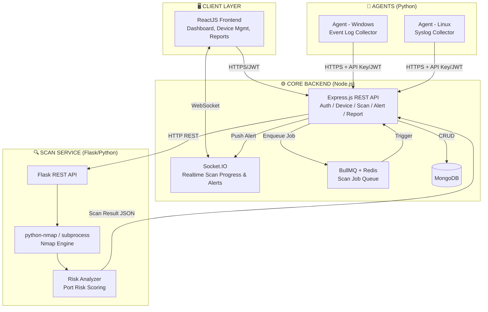
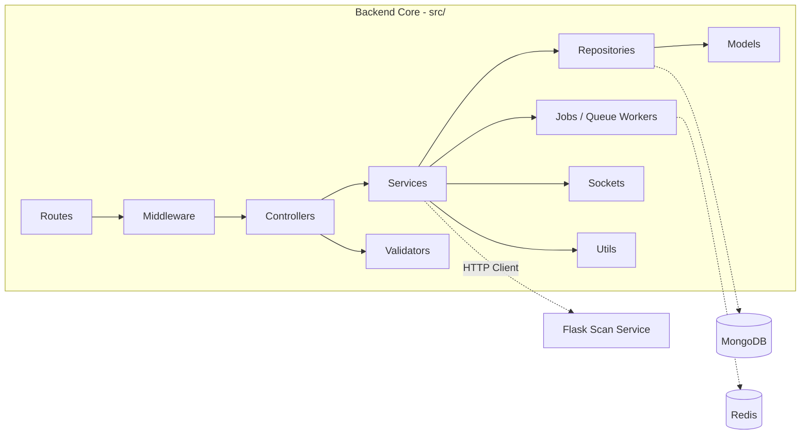
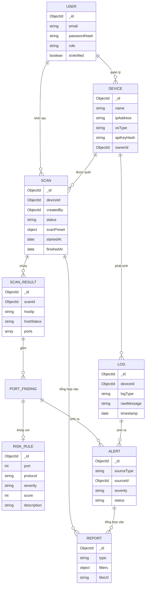
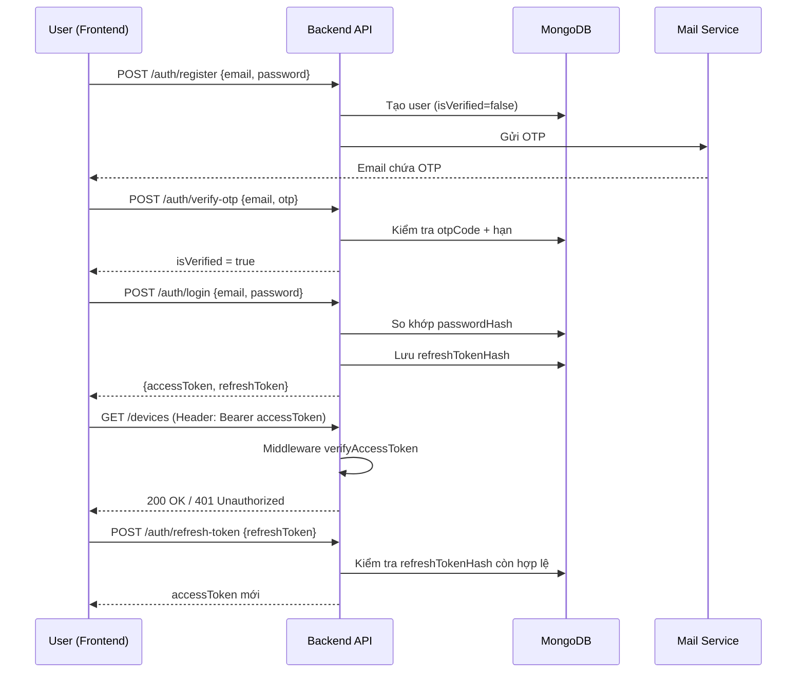
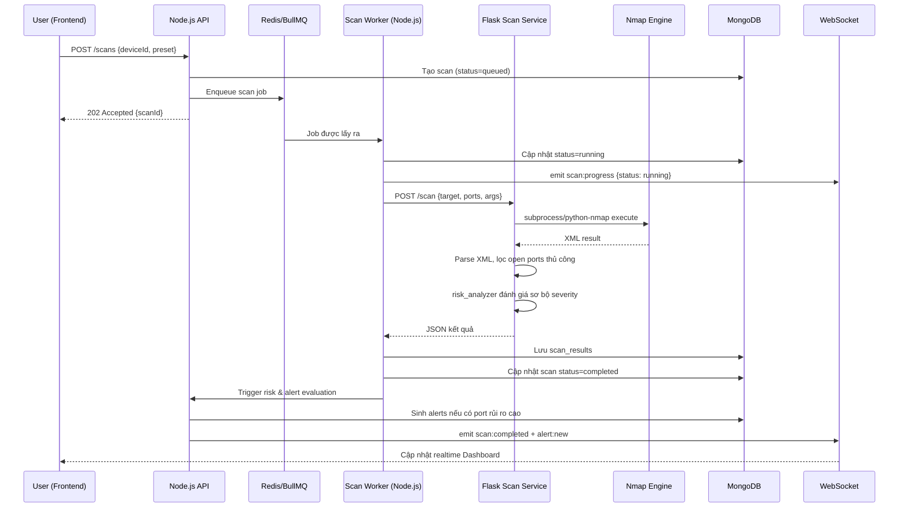
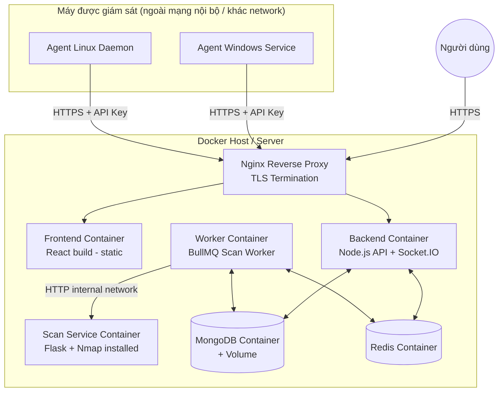

# THIẾT KẾ KIẾN TRÚC HỆ THỐNG
## Đề tài: Xây dựng hệ thống dò quét mạng TCP ứng dụng Nmap nhằm phát hiện các rủi ro bảo mật trong hệ thống mạng

---

## 1. OVERALL ARCHITECTURE

Hệ thống được thiết kế theo mô hình **Microservices tối giản (Modular Services)**, gồm 4 thành phần độc lập, giao tiếp qua REST API / Message Queue:



**Nguyên tắc thiết kế:**
- **Core Backend (Node.js)**: đóng vai trò API Gateway + Business Logic + Orchestrator. Không trực tiếp chạy Nmap.
- **Scan Service (Flask)**: microservice riêng biệt, chỉ chịu trách nhiệm thực thi Nmap và trả kết quả thô/đã phân tích rủi ro cơ bản (port-level). Tách riêng để cô lập tiến trình subprocess Nmap khỏi Node.js (tránh block event loop, dễ scale ngang theo số lượng scan song song).
- **Agent**: chạy độc lập trên các máy được giám sát, gửi log định kỳ về Core Backend qua REST API có xác thực bằng API Key riêng cho từng thiết bị (device token).
- **Queue (Redis + BullMQ)**: xử lý scan bất đồng bộ, tránh timeout HTTP khi quét nhiều host/port, hỗ trợ retry, cancel, progress tracking.
- **WebSocket**: đẩy trạng thái scan real-time (queued → running → parsing → done) và cảnh báo mới về Dashboard.

---

## 2. COMPONENT DIAGRAM



**Luồng xử lý chuẩn (Clean Architecture):**
`Route → Middleware (auth/validate) → Controller (nhận request/trả response) → Service (business logic) → Repository (truy vấn DB) → Model (schema)`

Controller **không bao giờ** gọi thẳng Model. Service **không bao giờ** biết Express `req/res`.

---

## 3. FOLDER STRUCTURE

### 3.1 Backend Core (Node.js)

```
backend/
├── src/
│   ├── config/
│   │   ├── env.js                  # Load & validate biến môi trường
│   │   ├── database.js             # Kết nối MongoDB
│   │   ├── redis.js                # Kết nối Redis
│   │   └── logger.js               # Winston logger config
│   ├── controllers/
│   │   ├── auth.controller.js
│   │   ├── device.controller.js
│   │   ├── scan.controller.js
│   │   ├── log.controller.js
│   │   ├── risk.controller.js
│   │   ├── alert.controller.js
│   │   └── report.controller.js
│   ├── services/
│   │   ├── auth.service.js
│   │   ├── device.service.js
│   │   ├── scan.service.js
│   │   ├── scanClient.service.js   # HTTP client gọi Flask Scan Service
│   │   ├── log.service.js
│   │   ├── risk.service.js
│   │   ├── alert.service.js
│   │   ├── report.service.js
│   │   └── mail.service.js         # Gửi OTP email
│   ├── repositories/
│   │   ├── user.repository.js
│   │   ├── device.repository.js
│   │   ├── scan.repository.js
│   │   ├── log.repository.js
│   │   ├── alert.repository.js
│   │   └── report.repository.js
│   ├── middleware/
│   │   ├── auth.middleware.js      # verifyAccessToken, verifyDeviceKey
│   │   ├── role.middleware.js      # RBAC (admin/analyst/viewer)
│   │   ├── error.middleware.js     # Global error handler
│   │   ├── rateLimit.middleware.js
│   │   └── validate.middleware.js  # Chạy Joi/Zod schema
│   ├── routes/
│   │   ├── index.js
│   │   ├── auth.route.js
│   │   ├── device.route.js
│   │   ├── scan.route.js
│   │   ├── log.route.js
│   │   ├── alert.route.js
│   │   └── report.route.js
│   ├── models/
│   │   ├── user.model.js
│   │   ├── device.model.js
│   │   ├── scan.model.js
│   │   ├── scanResult.model.js
│   │   ├── log.model.js
│   │   ├── alert.model.js
│   │   ├── riskRule.model.js
│   │   └── report.model.js
│   ├── utils/
│   │   ├── apiResponse.js          # Chuẩn hoá response {success, data, message}
│   │   ├── apiError.js             # Custom Error class
│   │   ├── asyncHandler.js         # Wrapper try/catch cho controller
│   │   ├── jwt.util.js
│   │   └── otp.util.js
│   ├── validators/
│   │   ├── auth.validator.js
│   │   ├── device.validator.js
│   │   ├── scan.validator.js
│   │   └── report.validator.js
│   ├── sockets/
│   │   ├── index.js
│   │   ├── scan.socket.js
│   │   └── alert.socket.js
│   ├── jobs/
│   │   ├── queue.js                 # BullMQ queue definitions
│   │   ├── scan.worker.js           # Worker xử lý job quét
│   │   └── report.worker.js
│   ├── docs/
│   │   └── swagger.yaml
│   ├── app.js                       # Khởi tạo Express app
│   └── server.js                    # Entry point, start HTTP + Socket server
├── .env.example
├── package.json
└── Dockerfile
```

### 3.2 Scan Service (Flask/Python)

```
scan-service/
├── app/
│   ├── __init__.py
│   ├── config.py
│   ├── routes/
│   │   └── scan_routes.py
│   ├── services/
│   │   ├── nmap_scanner.py
│   │   └── risk_analyzer.py
│   ├── schemas/
│   │   └── scan_schema.py
│   └── utils/
│       ├── logger.py
│       └── xml_parser.py
├── requirements.txt
├── run.py
└── Dockerfile
```

### 3.3 Agent (Python)

```
agent/
├── agent/
│   ├── main.py
│   ├── config.py
│   ├── collectors/
│   │   ├── windows_event_collector.py
│   │   ├── linux_syslog_collector.py
│   │   └── system_info_collector.py
│   ├── sender/
│   │   └── api_client.py
│   └── scheduler.py
├── requirements.txt
└── install/ (systemd service / Windows service scripts)
```

### 3.4 Frontend (ReactJS)

```
frontend/
├── src/
│   ├── api/              # axios instance + service calls theo module
│   ├── components/
│   ├── pages/
│   ├── layouts/
│   ├── hooks/
│   ├── store/             # Redux Toolkit / Zustand
│   ├── routes/
│   ├── sockets/
│   └── utils/
├── package.json
```

---

## 4. DATABASE DESIGN & ERD (Conceptual)

Mặc dù dùng MongoDB (NoSQL), ta vẫn thiết kế ERD ở mức khái niệm để xác định quan hệ trước khi denormalize vào các collection.



---

## 5. MONGODB COLLECTIONS (Schema chi tiết)

### 5.1 `users`
```js
{
  _id: ObjectId,
  fullName: String,
  email: String,             // unique, index
  passwordHash: String,
  role: String,               // enum: admin | analyst | viewer
  isVerified: Boolean,
  otpCode: String,            // hashed, TTL index
  otpExpiresAt: Date,
  refreshTokens: [{ tokenHash: String, userAgent: String, createdAt: Date, expiresAt: Date }],
  lastLoginAt: Date,
  createdAt: Date,
  updatedAt: Date
}
```

### 5.2 `devices`
```js
{
  _id: ObjectId,
  name: String,
  ipAddress: String,          // index
  hostname: String,
  osType: String,              // windows | linux | other
  location: String,
  tags: [String],
  apiKeyHash: String,          // dùng cho Agent xác thực
  status: String,               // active | inactive | unreachable
  ownerId: ObjectId,           // ref users
  createdAt: Date,
  updatedAt: Date
}
```

### 5.3 `scans`
```js
{
  _id: ObjectId,
  deviceId: ObjectId,          // ref devices, index
  createdBy: ObjectId,         // ref users
  targetIp: String,
  scanPreset: {
    type: String,               // quick | full | custom
    ports: String,              // "1-1000" hoặc "22,80,443"
    arguments: [String]         // list-based nmap args, KHÔNG dùng --open
  },
  status: String,                // queued | running | parsing | completed | failed | cancelled
  progress: Number,              // 0-100
  errorMessage: String,
  startedAt: Date,
  finishedAt: Date,
  createdAt: Date
}
```

### 5.4 `scan_results`
```js
{
  _id: ObjectId,
  scanId: ObjectId,            // ref scans, index
  hostIp: String,
  hostStatus: String,           // up | down
  ports: [
    {
      port: Number,
      protocol: String,          // tcp | udp
      state: String,             // open | closed | filtered
      service: String,
      product: String,
      version: String,
      riskSeverity: String,      // critical | high | medium | low | info
      riskScore: Number
    }
  ],
  osGuess: String,
  scanDurationMs: Number,
  createdAt: Date
}
```

### 5.5 `risk_rules`
```js
{
  _id: ObjectId,
  port: Number,
  protocol: String,
  serviceName: String,
  severity: String,             // critical | high | medium | low | info
  baseScore: Number,
  description: String,
  recommendation: String
}
```

### 5.6 `logs`
```js
{
  _id: ObjectId,
  deviceId: ObjectId,          // index
  logType: String,               // windows_event | linux_syslog | agent_heartbeat
  source: String,
  severity: String,
  rawMessage: String,
  parsedData: Object,
  timestamp: Date,              // index (TTL nếu cần)
  receivedAt: Date
}
```

### 5.7 `alerts`
```js
{
  _id: ObjectId,
  sourceType: String,           // scan_result | log
  sourceId: ObjectId,
  deviceId: ObjectId,           // index
  title: String,
  description: String,
  severity: String,              // critical | high | medium | low | info
  status: String,                // new | acknowledged | resolved | ignored
  assignedTo: ObjectId,
  createdAt: Date,
  resolvedAt: Date
}
```

### 5.8 `reports`
```js
{
  _id: ObjectId,
  type: String,                  // scan_summary | risk_summary | device_report
  title: String,
  filters: Object,
  format: String,                // pdf | xlsx
  fileUrl: String,
  generatedBy: ObjectId,
  createdAt: Date
}
```

---

## 6. API DESIGN (tổng quan theo module)

| Module | Method | Endpoint | Mô tả |
|---|---|---|---|
| Auth | POST | `/api/v1/auth/register` | Đăng ký |
| Auth | POST | `/api/v1/auth/verify-otp` | Xác thực email OTP |
| Auth | POST | `/api/v1/auth/login` | Đăng nhập, trả access + refresh token |
| Auth | POST | `/api/v1/auth/refresh-token` | Cấp lại access token |
| Auth | POST | `/api/v1/auth/logout` | Thu hồi refresh token |
| Device | GET/POST | `/api/v1/devices` | Danh sách / tạo thiết bị |
| Device | GET/PUT/DELETE | `/api/v1/devices/:id` | Chi tiết / cập nhật / xoá |
| Device | POST | `/api/v1/devices/:id/regenerate-key` | Cấp lại API key cho Agent |
| Scan | POST | `/api/v1/scans` | Tạo scan job (enqueue) |
| Scan | GET | `/api/v1/scans` | Danh sách scan (filter, paginate) |
| Scan | GET | `/api/v1/scans/:id` | Chi tiết + kết quả scan |
| Scan | PATCH | `/api/v1/scans/:id/cancel` | Huỷ scan đang chạy |
| Log | POST | `/api/v1/logs/ingest` | Agent gửi log định kỳ |
| Log | GET | `/api/v1/logs` | Truy vấn log (lọc theo device/type/time) |
| Risk | GET | `/api/v1/risk-rules` | Danh sách rule đánh giá rủi ro |
| Alert | GET | `/api/v1/alerts` | Danh sách cảnh báo |
| Alert | PATCH | `/api/v1/alerts/:id/status` | Cập nhật trạng thái xử lý |
| Report | POST | `/api/v1/reports/generate` | Sinh báo cáo |
| Report | GET | `/api/v1/reports/:id/download` | Tải báo cáo |

Chuẩn response thống nhất:
```json
{ "success": true, "data": { }, "message": "OK" }
{ "success": false, "message": "Error message", "errors": [] }
```

---

## 7. AUTHENTICATION FLOW

Hai loại xác thực song song:
1. **User Auth**: JWT dual-token (Access Token 15’ + Refresh Token 7 ngày, lưu hash trong DB) + OTP email khi đăng ký.
2. **Device/Agent Auth**: API Key riêng cho từng thiết bị (hash lưu DB, so sánh timing-safe), gửi qua header `X-Device-Key`.



---

## 8. SEQUENCE DIAGRAM — LUỒNG TCP SCAN (module lõi)



---

## 9. DEPLOYMENT ARCHITECTURE



**Ghi chú triển khai:**
- Toàn bộ dùng `docker-compose` cho môi trường dev/demo bảo vệ đồ án; production có thể tách riêng Scan Service ra máy có quyền raw socket (Nmap SYN scan cần quyền root/Administrator).
- Scan Service container cần image có cài sẵn `nmap` binary (không chỉ thư viện `python-nmap`).
- Backend và Scan Service giao tiếp qua **internal Docker network**, không expose ra ngoài Internet.
- Agent chỉ cần biết endpoint public của Nginx + API Key riêng, không cần biết cấu trúc nội bộ hệ thống.

---

## 10. LỘ TRÌNH PHÁT TRIỂN (PHASES)

| Phase | Module | Nội dung chính |
|---|---|---|
| 1 | **Authentication** | Register, OTP verify, Login, JWT dual-token, Refresh, Logout, RBAC middleware |
| 2 | **Device Management** | CRUD device, API key generation/regenerate, device status |
| 3 | **TCP Scan** | Scan Service Flask + Nmap, tạo/enqueue scan job, worker xử lý, lưu kết quả, realtime progress |
| 4 | **Log Management** | Agent thu thập log (Windows Event Log / Linux Syslog), API ingest log, truy vấn/lọc log |
| 5 | **Risk Analysis** | Risk rule database, risk scoring engine, gắn severity vào scan_results |
| 6 | **Alert** | Sinh alert tự động từ scan/log, quản lý trạng thái alert, realtime notification |
| 7 | **Report** | Sinh báo cáo PDF/Excel, export, lịch sử báo cáo |

Mỗi phase sẽ được triển khai tuần tự theo đúng format: Phân tích chức năng → Thiết kế DB → Thiết kế API → Cấu trúc thư mục → Code đầy đủ → Giải thích → Cách chạy → Test Postman → Lỗi thường gặp.

---

**Sẵn sàng bắt đầu Phase 1 - Authentication khi bạn xác nhận.**
